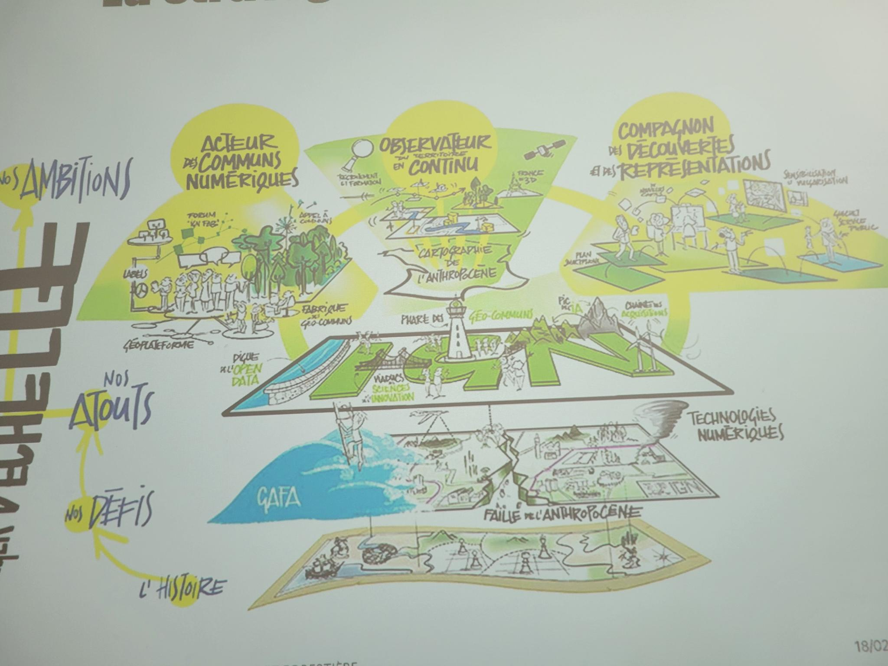

# Présentation de Philippe Abadie

Délégué Régional

Passage au numérique en 40 ans, 1986 début de la BD Topo numérique.

ENSG -> Geoata Paris

## Un institut en très forte transformation

- Données génériques -> Données thématiques métiers

- Données statiques -> Données dynamiques et de simulation

- Données Payantes -> Données ouvertes et gratuites (80% de subvention + 20 % issues des autres ministères)

## Sans IA pas de cartes

COSIA et COS GE : https://geoservices.ign.fr/cosia  
CARHAB  
LIDAR HD  
GEO K PHYTO  
BD FORET  
BD HAIE  

## Les défis

- La donnée géo est partout
- La connaissance du territoire est indispensable
- La cartographique publique doit devenir un instrument d'émancipation
=> L'anthropocène lance un nouveau défi à la cartographie

## La stratégie en dessin

## L'offre 3D par prise de vue aérienne

- Des nuages de points
- Des modèles numériques de terrain
- Courbes de niveaux

**Des produits** : 
- BD ALTI
- RGE ALTI 
- LIDAR 
- France Relief MNT

> [!IMPORTANT]  
> On aura la présentation, je voulais jste écrire en Markdown

## Géoplateforme et Cartes.gouv.fr

S'inscrire !

Modèle économique financé par les "gros" 

**Géolateforme** => services  
**Data.gouv** => catalogue de données